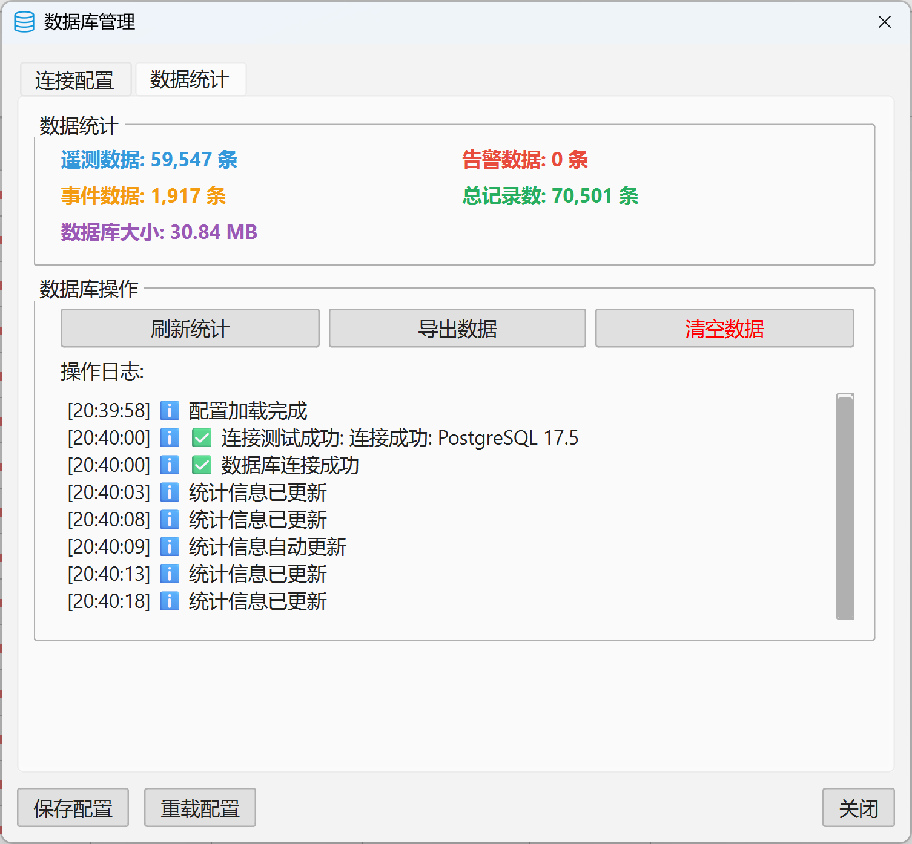

# 基于 PySide6 的半导体工艺设备监控与分析系统

# SEMS-Semiconductor Equipment Monitoring System

### 技术栈

**前端框架**: PySide6 (Qt6) - 跨平台桌面应用开发
**数据可视化**: PyQtGraph - 高性能实时图表绘制
**通信协议**: MQTT - 设备数据采集与实时通信
**数据库**: PostgreSQL + psycopg2 - 海量时序数据存储
**并发处理**: ThreadPoolExecutor - 多线程数据处理

### 系统架构

- **MVC 架构模式**: 模块化设计，UI 与业务逻辑分离
- **事件驱动**: DataBus 消息总线，解耦数据流
- **单例模式**: 全局资源管理 (DatabaseManager, DeviceManager)
- **观察者模式**: 设备状态变化实时通知机制

### 核心功能模块

- **实时数据监控**: 多设备并发数据采集与展示
- **设备状态管理**: 在线/离线状态自动检测与更新
- **历史数据分析**: 时序数据查询、统计与趋势分析
- **多视图展示**: 设备概览表格 + MDI 子窗口图表系统
- **数据持久化**: 批量插入优化，支持高频数据写入

### 技术亮点

- **高性能数据处理**: 连接池 + 批量操作，支持>10K 条/秒数据吞吐
- **自适应 UI 组件**: 动态图表生成，参数字段自动识别与渲染
- **内存优化**: deque 循环缓冲区，防止内存泄漏
- **实时性保障**: 30 秒心跳检测，毫秒级状态更新
- **可扩展架构**: 插件化设计，支持新设备类型快速接入

### 应用场景

- 半导体制造设备 (ETCH/WET/CVD 等) 生产监控
- 工艺参数实时跟踪 (温度/压力/RF 功率/气体流量)
- 设备健康状态评估与预警
- 生产数据可视化分析与报表

### 界面展示

<figure>
  
  <figcaption>主界面
  顶部自定义MenuBar;左侧可视化状态控制；
  中间实时设备状态与数据可视化；
  右侧设备选择与实时数据显示；
  底部状态显示。
 </figcaption>
</figure>
<figure>
  
  <figcaption>基于QMdiArea和PyQtGraph的实时数据绘制；支持数据窗口以及交互式浏览</figcaption>
</figure>
<figure>
  
  <figcaption>网络调试窗口；支持调试连接的数据服务；可进一步拓展到Modbus，Http数据服务</figcaption>
</figure>
<figure>
  
  <figcaption>数据库管理窗口；通过图形化操作连接PostgreSQL数据库，支持进一步拓展到MySQL，SQLite等数据库</figcaption>
</figure>
<figure>
  
  <figcaption>数据库数据统计</figcaption>
</figure>
